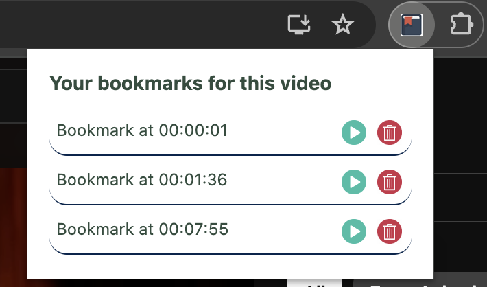

## Installation Instructions

1. **Download and Extract:**
   - Download the zip file and extract its contents.

2. **Load the Extension in Chrome:**
   - Open Chrome and navigate to `chrome://extensions/`.
   - Enable "Developer mode" by toggling the switch in the top right corner.
   - Click on "Load unpacked" and select the extracted folder.

3. **Clear History:**
   - Clear your browser history to ensure the extension functions correctly.

4. **Using the Extension:**
   - After installing the extension, you will see a `+` button on YouTube.
     
   - Clicking the `+` button will add bookmarks at the current timestamp in the video.
     
